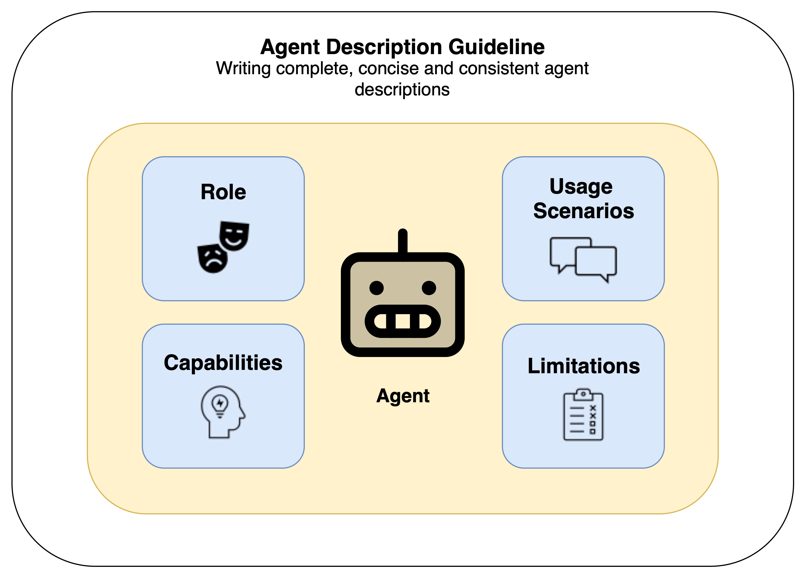
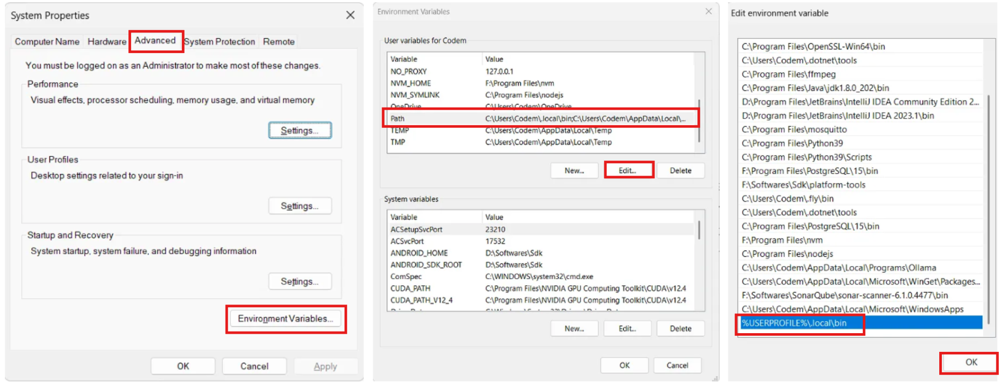

# AgentDesignHelper



## Motivation

The Agent Design Helper tool is a tool, helps you to write better agent descriptions and reduce the overlap in your Multi-Agent System.
It currently has the following features:
- Tutorial: How to write good agent descriptions.                            
- Description optimization: The description optimizer supports you to write high-quality agent descriptions for your specialized agent
- Description evaluation: Evaluate your agent description for certain quality criteria.
- Static overlap analysis: Analyze overlap between multiple agent descriptions and get guidance on resolving conflicts. 
- Dynamic overlap analysis: Test your user queries to analyze the overlap/ conflicts between multiple agents that can arise in multi-agent orchestration.

## Getting started
This project needs additional python libraries (like openai, gradio etc.) and the package manager uv.
Uv is a lightweight and extremely fast Python package manager (10x - 100x faster than pip install). You can find a quick UV tutorial here: [Introducing uv](https://codemaker2016.medium.com/introducing-uv-next-gen-python-package-manager-b78ad39c95d7).
To use uv, we will add it to the system path. This way you can execute uv commands from the console in every directory of your PC.
Additionally, we will create a virtual environment (venv). This environment will contain and manage all the packages (dependencies) installed by the package manager uv. By using a virtual environment, we can avoid dependency/ version conflicts with other python environments on your PC.

### Six steps to get you started
0. Clone the repo to your directory
```bash
cd your-project-directory
git clone https://github.com/FabianHildebrandt/AgentDesignHelper.git
```
1. Install uv
```bash
pip install uv
```
2. Add uv to the PATH variable (so that you can do uv commands everywhere).
- Linux/ macOS:
```bash
export PATH="$HOME/.local/bin:$PATH"
```
- Windows:
Open the environment variables dialogue as shown on the image (System properties -> Advanced -> Environment variables), edit the `Path` variable and add a new value `%USERPROFILE%\.local\bin`. 



3. Create a virtual environment
```bash
uv venv
```

4. Activate the virtual environment 
```bash
# On macOS and Linux.
source .venv/bin/activate

# On Windows.
.venv\Scripts\activate
```

4. To synchronize the locked dependencies with the virtual environment, use the following command:
```bash
cd agentdesignhelper
uv pip install -r requirements.txt  # Install dependencies from a requirements.txt file.
```

5. Run the app
```bash
uv run app.py
```

**Bonus tip**: if you don't want to copy & paste the API key everytime you start a new session, copy it to the config.yaml.
